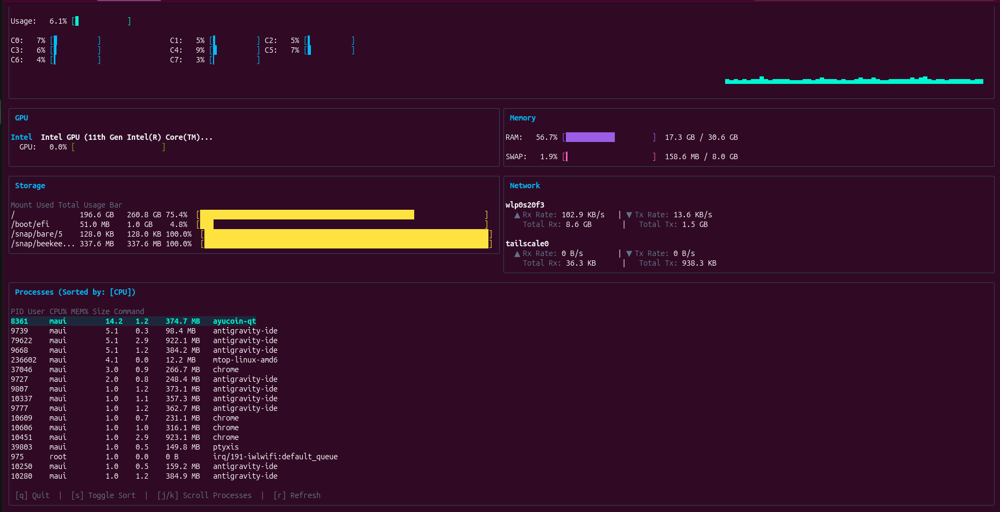

# 🚀 Mtop — Premium System Monitor TUI Tailored for Proxmox LXC & Bare Metal

[](https://goreportcard.com/report/github.com/maui/mtop)
[](https://golang.org)
[](https://mtop.kpst.my)

**Mtop** is a lightweight, premium terminal user interface (TUI) system monitoring application inspired by the elegance of Btop. Written entirely in **Go**, Mtop solves the challenge of monitoring system resources inside **Proxmox LXC containers** and physical machines (**Bare Metal**) by delivering clean, accurate, and clutter-free real-time stats!

🌐 **Visit our official website:** [https://mtop.kpst.my](https://mtop.kpst.my)

---



---

## 🔥 Why Mtop?

Running standard system monitors (like `htop` or `btop`) inside an LXC container often reports host statistics instead of container limitations (displaying the host's 64 CPU cores or 256GB RAM when your container is allocated only 2 cores and 4GB RAM).

**Mtop resolves this completely!** It intelligently queries container-level **cgroups v2** configurations to isolate and restrict resource usage reporting to reflect your exact LXC allocations automatically.

### ✨ Key Features:

- **🎯 Exact Core Mapping:** Restricts the core list to display only those assigned to the container by Proxmox (e.g., displaying only 2 cores if the LXC is limited to 2, despite host capacity).
- **📈 Real-Time CPU History Sparkline:** View a graphical history of CPU load over time using block characters, rendering right alongside your per-core usage.
- **🎮 GPU Detection & Monitoring:** Automatically detects primary graphics processors (**NVIDIA, AMD, and Intel**) and prints core load, VRAM usage, and temperatures directly.
- **🧠 Accurate Memory Calculations:** Shows exact active RAM and Swap capacities under cgroup v2 limits, ignoring reclaimable page cache memory (`inactive_file`) for accurate results matching `free -m`.
- **💾 Filtered Storage Stats:** Suppresses host-level ZFS storage pools or logical volumes (LVM) to focus solely on the container root filesystem (`/`) and active mounts.
- **🔌 Clean Network Monitoring:** Excludes Virtual Network Interfaces (like `veth*` or loopbacks `lo`) so you only see active network adapters (`eth0`, `wlan0`).
- **🎨 Premium Visuals:** Uses the **Charm Bubble Tea** & **Lipgloss** frameworks for a modern console dashboard featuring smooth unicode indicators and rounded panels.
- **⚡ Process Manager with Kill Switch:** Inspect processes dynamically. Scroll with `j`/`k`, change sorting metrics (CPU%, MEM%, PID, Name) with `s`, and terminate selected processes instantly by pressing **`9`** (sends `SIGKILL`).

## 📦 Easy Installation (APT & DNF)

Install Mtop automatically on your system using the installer script (detects your package manager and installs native packages/binaries):

```bash
curl -sS https://raw.githubusercontent.com/maui2023/mtop/main/install.sh | sudo bash
```

### Manual APT Repository Configuration (Debian/Ubuntu/Proxmox)
To manually add our APT repository:
```bash
echo "deb [trusted=yes] https://raw.githubusercontent.com/maui2023/mtop/main/apt stable main" | sudo tee /etc/apt/sources.list.d/mtop.list
sudo apt update
sudo apt install mtop
```

---

## 🛠️ Build & Installation

### Prerequisites
- Go (Golang) 1.18 or higher.

### Local Development
To build the binary for your local environment:
```bash
make build
```
This generates the executable named `mtop`. Run it directly:
```bash
./mtop
```

### Cross-Compilation (Cross-Build Releases)
To compile lightweight, static release binaries for AMD64, ARM 32-bit, and ARM64 systems (perfect for deployment across various homelab clusters and machines):
```bash
make release
GOOS=linux GOARCH=arm go build -o mtop-linux-arm main.go
```
This produces `mtop-linux-amd64`, `mtop-linux-arm`, and `mtop-linux-arm64`. Copy the single target binary to any container or system, and it will run instantly with zero dependencies.

---

## ⌨️ Controls & Keybindings

- `q` or `Ctrl+C`: Quit the application.
- `s`: Change process sorting order (toggles through CPU%, Memory%, PID, Name).
- `j` / `k` (or `Arrow Down` / `Arrow Up`): Scroll up/down the process list.
- `9`: Kill the highlighted process (SIGKILL).
- `r`: Manually refresh system statistics (statistics update automatically every 1 second by default).
